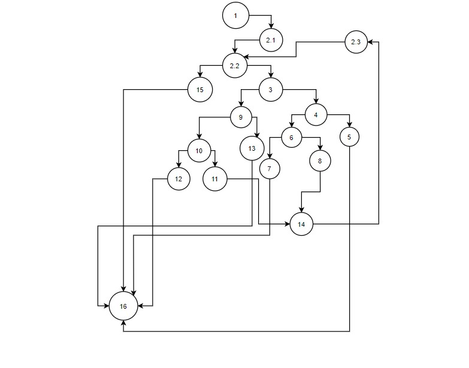

# SI_lab2_183048
Втора лабораториска вежба по Софтверско инженерство   
Мелина Стојановска, бр. на индекс 183048  
1.Група на код: 
Ја добив групата на код 6. 
2.Control flow graph: 
 
3.Цикломатската комплексност на овој код е 7, бидејќи бројот на предикатни јазли е 6, а формулата за цикломатска комплексност е P+1, 
односно 6+1=7. Исто така, бројот на ребра е 23, а на јазли 18, па и според формулата E-N+2=7. 
4.Според критериумот Every path, ги добиваме патеките {1,2.1,2.2,15,16}; {1 2.1 (2.2,3,9,10,11,14,2.3,2.2) 15, 16}; {1,2.1,2.2,3,9,13,16};
{1,2.1,2.2,3,9,10,12,16}; {1,2.1,2.2,3,4,5,16}; {1,2.1,2.2,3,4,6,7,16}; {1,2.1,(2.2,3,4,6,8,14,2.3,2.2)15,16}. За секоја од овие патеки се објаснети тест случаевите во прашањето за unit тестови. 
Според критериумот Multiple conditions постојат 4 јазли кои ги проверуваме: 3,4,7,10.
Во јазелот 3, можни случаеви се:  
T&&T T&&F F&&T F&&F  
Во јазелот 4, можни случаеви се:  
Т||X F||T F||F  
Во јазелот 7 можни случаеви се:  
T||X F||T F||F  
Во јазелот 10 можни случаеви се:  
T&&T T&&F F&&T F&&F  
5. Unit тестовите за секоја од Every path критериумот се: 
//1 2.1 2.2 15 16 -> ако листата е null  
//1 2.1 2.2 3 9 10 12 16 -> deg=360; min!=0; sec!=0 ///min=2,sec=3;  
//1 2.1 2.2 3 9 10 11 14 2.3 2.2 15 16 --> deg=360 min=0 sec=0  
//1 2.1 2.2 3 9 13 16 ---> deg!=360; deg=400  
//1 2.1 2.2 3 4 5 16 ----> deg>=0 deg<360// deg=70//  min<0 ||min>59 //min=80  
//1 2.1 2.2 3 4 6 7 16 ---> deg=50 min=35 sec=70  
//1 2.1 2.2 3 4 6 8 14 2.3 2.2 15 16 ---> deg=80 min=30 sec =20  

